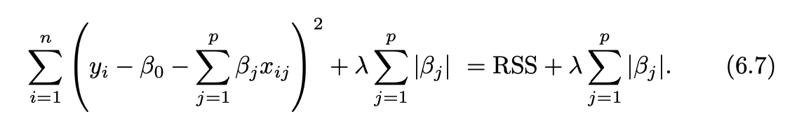

```{r include=F}
knitr::opts_chunk$set(echo=T, eval = F, message = F, warning = F)
load("data.Rdata")
```

class: center, middle

## Keep in touch

[`r icons::fontawesome("envelope")` sckinta@gmail.com](mailto:sckinta@gmail.com)

[`r icons::fontawesome("github")` @sckinta](http://github.com/sckinta)

[`r icons::fontawesome("user")` learniningwithsckinta.netlify.app](https://learniningwithsckinta.netlify.app)

[`r icons::fontawesome("heart")` R-Ladies Philly](https://www.rladiesphilly.org/)


---
## Why need alternative fitting procedures?

- prediction accuracy (p > n)

  - shrink the estimated coefficients to reduce the variance at the cost of a negligible increase in bias.
  
<br>

- model interpretability

  - automatic feature selection by setting coefficients to 0

???
https://stats.stackexchange.com/questions/282663/why-is-n-p-a-problem-for-ols-regression

---
## What are alternative methods to least square fit?

- subset selection

- shrinkage/regularization

- dimension reduction

---
## Subset selection

- best subset selection
  - `2^p` models
  
???
RSS of these p + 1 models decreases monotonically, and the R2 increases monotonically, as the number of features included in the models increases.

in Step 3, we use cross-validated prediction
best subset selection

In the case of logistic regression, instead of ordering models by RSS in Step 2 of Algorithm 6.1, we instead use the deviance, a measure that plays the role of RSS for a broader class of models. The deviance is negative two times the maximized log-likelihood; the smaller the deviance, the better the fit.
  
---
## Subset selection
- Forward Stepwise Selection
  - `p*(p + 1)/2 + 1` models
  
  - can be applied even in the high-dimensional setting where n < p, but only M(0) ~ M(n-1) submodel search.
???
M1 has p-0 models, M2 used one variable on M1 and select from rest p-1 models, ... Mp used select 1
(p + 1) * p /2 + 1

Though forward stepwise tends to do well in practice, it is not guaranteed to find the best possible model out of all 2p mod- els containing subsets of the p predictors.

Forward stepwise selection can be applied even in the high-dimensional setting where n < p; however, in this case, it is possible to construct sub- models M0, . . . , Mn−1 only, since each submodel is fit using least squares, which will not yield a unique solution if p ≥ n.

---
## subset selection
- Backward Stepwise Selection
  - `p*(p + 1)/2 + 1` models
  
  - require n > p

---
## subset selection 
 - indirectly estimate test error
 
   
   
   
   

???
d is the number of predictors, sigma^2 is the variance when using all predictors.

The intuition behind the adjusted R2 is that once all of the correct variables have been included in the model, adding additional noise variables will lead to only a very small decrease in RSS

---
## subset selection 
 - directly estimate test error using CV
 
   - **one-standard-error rule**
   >  We first calculate the one-standard error of the estimated test MSE for each model size, and then standard- select the smallest model for which the estimated test error is within one error standard error of the lowest point on the curve
???
In this setting, we can select a model using the one-standard-error rule. We first calculate the one-standard error of the estimated test MSE for each model size, and then standard- select the smallest model for which the estimated test error is within one error standard error of the lowest point on the curve


---
## Shrinkage Methods

- ridge regularization (L2)


- lasso regularization (L1)
  - lasso yields sparse models - variable selection


  
???
As λ increases, the flexibility of the ridge regression fit decreases, leading to decreased variance but increased bias.

https://www.quora.com/Why-adding-more-variables-reduces-the-Residual-Square-Sums-RSS-in-a-linear-model

---
### The lasso leads to feature selection

???
Since ridge regression has a circular constraint with no sharp points, this intersection will not generally occur on an axis, and so the ridge regression coefficient estimates will be exclusively non-zero. However, the lasso constraint has corners at each of the axes, and so the ellipse will often intersect the constraint region at an axis.

---
### Dimension reduction
- Principle component analysis (PCA)/principal components regression (PCR): 
    - assume the directions in which X1, . . . , Xp show the most variation are the directions that are associated with Y
    - tend to do well in cases when the first few principal components are sufficient to capture most of the variation in the predictors as well as the relationship with the response
    - When performing PCR, we generally recommend standardizing each predictor
    - ridge regression as a continuous version of PCR (no feature selection)

- partial least squares (PLS)
  - a supervised alternative to PCR - computes the first direction Z1 by setting each φj1 in (6.16) equal to the coefficient from the simple linear regression of Y onto Xj.
  - We generally standardize the predictors and response before performing PLS
  - In practice it often performs no better than ridge regression or PCR. 
  
---
### high dimensional consideration
- p slightly smaller than n is also considered as high dimensional data


- why p > n situation least square regression wont work
  - overfitting (figure 6.22)
  
- the Cp, AIC, and BIC and adjust R2 approaches are not appropriate in the high-dimensional setting

- **curse of dimensionality**: the test error tends to increase as the dimensionality of the problem (i.e. the number of features or predictors) increases, unless the additional features are truly associated with the response.

- In the high-dimensional setting, the multicollinearity problem is extreme: any variable in the model can be written as a linear combination of all of the other variables in the model.

- never use sum of squared errors, p-values, R2 statistics, or other traditional measures of model fit on the training data as evidence of a good model fit in the high-dimensional setting.
---
### functions
-  best subset selection: `leaps::regsubsets(Salary ∼ ., Hitters, nvmax = 8)`
  - up to p = 8 model
  - The `summary()` function also returns R2, RSS, adjusted R2, Cp, and BIC. We can examine these to try to select the best overall model
- forward selection: `regsubsets(Salary ∼ ., data = Hitters, nvmax = 19, method = "forward")`
- backward selection: `regsubsets(Salary ∼ ., data = Hitters,
nvmax = 19, method = "backward")`

- 
