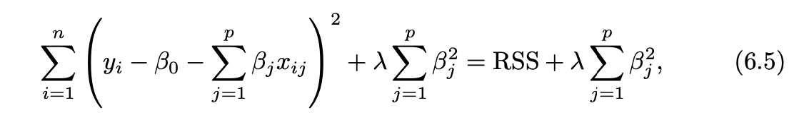
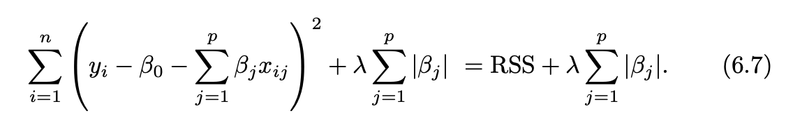

```{r include=F}
knitr::opts_chunk$set(echo=T, eval = T, message = F, warning = F)
```

---
## Alternative fitting procedures to OLS

#### Why?
- prediction accuracy (p > n)

  - shrink the estimated coefficients to reduce the variance at the cost of a negligible increase in bias.

- model interpretability

  - automatic feature selection by setting coefficients to 0

--

#### How?

- subset selection

- shrinkage/regularization

- dimension reduction

???
https://stats.stackexchange.com/questions/282663/why-is-n-p-a-problem-for-ols-regression

---
## subset selection
#### 3 algorithms
- Best subset selection (`2^p` models)
- Stepwise Selection (`p*(p + 1)/2 + 1` models)
 - forward
 - backward

--

#### how to estimate test error
- indirect
  - Cp, AIC, BIC, adjusted R2
- direct
  - cross validation
  > **one-standard-error rule**:
  > We first calculate the one-standard error of the estimated test MSE for each model size, and then select the smallest model for which the estimated test error is within one error standard error of the lowest point on the curve'
???
d is the number of predictors, sigma^2 is the variance when using all predictors.

The intuition behind the adjusted R2 is that once all of the correct variables have been included in the model, adding additional noise variables will lead to only a very small decrease in RSS

---
## Shrinkage Methods

- ridge regularization (L2)


- lasso regularization (L1)

  - lasso yields sparse models - variable selection
  
???
As λ increases, the flexibility of the ridge regression fit decreases, leading to decreased variance but increased bias.

https://www.quora.com/Why-adding-more-variables-reduces-the-Residual-Square-Sums-RSS-in-a-linear-model

---
## Dimension reduction

- Principle component analysis (PCA)/principal components regression (PCR) 

  - unsupervised learning
  
  - Ridge regression as a continuous version of PCR (no feature selection)

- Partial least squares (PLS)

  - a supervised alternative to PCR
  
  - In practice it often performs no better than ridge regression or PCR. 
---

## Hitter data

```{r}
if(!require("glmnet")){
    install.packages("glmnet")
}

if(!require("mixOmics")){
    if (!require("BiocManager", quietly = TRUE))
    install.packages("BiocManager")
    BiocManager::install("mixOmics")
    # library(mixOmics)
}
library(ISLR)
library(tidymodels)
library(workflowsets)


Hitters <- as_tibble(Hitters) %>%
  filter(!is.na(Salary))

Hitters
```

---
## data budget

```{r}
# initial split
set.seed(19)
data_split <- initial_split(Hitters, strata = "Salary")

data_train <- training(data_split)
data_test <- testing(data_split)

# 10-fold cross validation
data_fold <- vfold_cv(data_train, v = 10)
```

---
## data preprocess

Both lasso and ridge require scaled predictors.

```{r}
shrink_recipe <- 
  recipe(formula = Salary ~ ., data = data_train) %>% 
  step_novel(all_nominal_predictors()) %>% 
  step_dummy(all_nominal_predictors()) %>% 
  step_zv(all_predictors()) %>% 
  step_normalize(all_predictors())
```

PCA and PLS are tuned at preprocess recipe step. Here we are going to tune A fraction of the total variance that should be covered by the components. see more `?step_pca`

```{r}
pca_recipe <- shrink_recipe %>%
    step_pca(all_predictors(), num_comp = tune::tune())

pls_recipe <- shrink_recipe %>%
    step_pls(all_predictors(), num_comp = tune::tune(), outcome = "Salary")
```

---
## specify models - shrinkage model

Tune lamda: `linear_reg`

> The tidymodels uses standardized parameter names across models chosen to be low on jargon. **The argument penalty is the equivalent of what glmnet calls the lambda value and mixture is the same as their alpha value**.

> The regularization penalty, does not need to be specified when fitting the model. The package fits a compendium of values, called the regularization path. These values depend on the data set and the value of alpha, the mixture parameter between a pure ridge model (alpha = 0) and a pure lasso model (alpha = 1).

```{r}
ridge_spec <- 
  linear_reg(penalty = tune(), mixture = 0) %>% 
  set_mode("regression") %>% 
  set_engine("glmnet")

lasso_spec <- 
  linear_reg(penalty = tune(), mixture = 1) %>% 
  set_mode("regression") %>% 
  set_engine("glmnet")

```

https://github.com/tidymodels/yardstick/issues/152

---
## specify models - dimension reduction model

```{r}
lm_spec <- 
  linear_reg() %>% 
  set_mode("regression") %>% 
  set_engine("lm")
```


---
## specify tuning hyperparameter grid 

```{r}
# hyperparameter grid for penalty
penalty_grid <- grid_regular(
    penalty(range = c(-2, 2)), levels = 20
)

num_comp_grid <- grid_regular(
    num_comp(c(1, 20)), 
    levels = 20
)
## hyperparameter grid for penalty
```

---
## specify workflowset

```{r}
# workflowset
shrink_models <- 
   workflow_set(
      preproc = list(shrinkage = shrink_recipe, shrinkage = shrink_recipe, pca = pca_recipe, pls = pls_recipe),
      models = list(ridge = ridge_spec, lasso = lasso_spec, lm = lm_spec, lm = lm_spec),
      cross = F
   )

shrink_models
```

```{r echo=F, eval=F}
ridge_wf <- workflow() %>% 
    add_recipe(data_recipe) %>% 
    add_model(ridge_spec)

lasso_wf <- workflow() %>% 
    add_recipe(data_recipe) %>% 
    add_model(lasso_spec)

pca_workflow <- 
  workflow() %>% 
  add_recipe(pca_recipe) %>% 
  add_model(lm_spec)

pls_workflow <- 
  workflow() %>% 
  add_recipe(pls_recipe) %>% 
  add_model(lm_spec)
```

---
## Tune models

```{r echo=F, eval=F}
ridge_res <- ridge_wf  %>% 
    tune_grid(
        resamples = data_fold,
        grid = penalty_grid
    )

lasso_res <- lasso_wf %>% 
    tune_grid(
        resamples = data_fold,
        grid = penalty_grid
    )

pca_res <- pca_workflow %>% 
    tune_grid(
        resamples = data_fold,
        grid = num_comp_grid
    )

pls_res <- pls_workflow %>% 
    tune_grid(
        resamples = data_fold,
        grid = num_comp_grid
    )
```

```{r eval=F}
tune_res1 <- 
   shrink_models %>% 
    filter(grepl("shrinkage_", wflow_id)) %>% 
   workflow_map(
       "tune_grid", 
       resamples = data_fold, 
       grid = penalty_grid,
       control = control_resamples(save_pred = T))

tune_res2 <- 
   shrink_models %>% 
    filter(!grepl("shrinkage_", wflow_id)) %>% 
   workflow_map(
       "tune_grid", 
       resamples = data_fold, 
       grid = num_comp_grid,
       control = control_resamples(save_pred = T))

tune_res <- bind_rows(tune_res1, tune_res2)

tune_res %>% 
    collect_metrics() %>% 
    dplyr::select(wflow_id, .config,.metric, mean, std_err)
```

---
## Tuning result - `workflow_index`

```{r echo=F, fig.align='center', fig.width=12}
# one-standard-error-rule (OSER)
oser <- rank_results(tune_res, rank_metric = "rsq") %>%
    group_by(.metric) %>% 
    summarise(m_sd = sd(mean), m_min = min(mean), m_max = max(mean)) %>% 
    mutate(upbound = ifelse(.metric == "rmse", m_min + m_sd, m_max), 
           downbound = ifelse(.metric == "rmse", m_min, m_max - m_sd))

tune_res %>% 
    collect_metrics() %>% 
    dplyr::select(wflow_id, .metric, mean, std_err) %>% 
    bind_cols(
        tibble(index = 1:20) %>% 
            slice(rep(1:n(), each = 2)) %>% 
            slice(rep(1:n(), 4))
    ) %>% 
    ggplot(aes(x = index, y = mean, group =wflow_id, color = wflow_id)) +
    facet_wrap(~.metric, scales = "free_y") +
    geom_point() +
    geom_line() +
    geom_hline(data = oser, aes(yintercept = upbound), linetype = 3) +
    geom_hline(data = oser, aes(yintercept = downbound), linetype = 3) +
    theme_bw()
```

---
## Tuning result - `penalty`

```{r echo=F, fig.align='center', fig.width=12}
tune_res1 %>% 
    collect_metrics() %>% 
    dplyr::select(wflow_id, .metric, mean, std_err) %>% 
    separate(wflow_id, c("recipe", "model_spec"), sep="_") %>%
    bind_cols(
        penalty_grid %>% 
            slice(rep(1:n(), each = 2)) %>% 
            slice(rep(1:n(), 2))
    ) %>% 
    ggplot(aes(x = penalty, y = mean, group = model_spec, color = model_spec)) +
    facet_wrap(~.metric, scales = "free_y") +
    geom_point() +
    geom_line() +
    scale_x_log10() +
    theme_bw()
```

---
## Tuning result - `num_comp`

```{r echo=F, fig.align='center', fig.width=12}
tune_res2 %>% 
    collect_metrics() %>% 
    dplyr::select(wflow_id, .metric, mean, std_err) %>% 
    separate(wflow_id, c("recipe", "model_spec"), sep="_") %>%
    bind_cols(
        num_comp_grid %>% 
            slice(rep(1:n(), each = 2)) %>% 
            slice(rep(1:n(), 2))
    ) %>% 
    ggplot(aes(x = num_comp, y = mean, group =recipe, color = recipe)) +
    facet_wrap(~.metric, scales = "free_y") +
    geom_point() +
    geom_line() +
    theme_bw()
```

---
## Best hyperparameter overall

For workflow, we can simply use something along the lines of `best_model <- select_best(); finalize_workflow(best_model)` to select best workflow. However, no elegant way to do the same thing for workflowsets. ([More details](https://community.rstudio.com/t/what-is-workflows-select-best-finalize-workflow-fit-equivalent-for-workflowsets/143663))

```{r}
res_ranks <- rank_results(tune_res, rank_metric = "rsq", select_best = TRUE)

best_model <- res_ranks %>% 
    filter(rank==1) %>% 
    distinct(wflow_id, .config) %>% 
    separate(.config, c("preprocess", "model"), sep="_") %>% 
    mutate_at(c("preprocess", "model"), readr::parse_number) %>% 
    inner_join(
        num_comp_grid %>% mutate(preprocess = 1:n())
    )

best_model
```

---
## Best hyperparameter - best shrinkage


```{r}
best_model_shrink <- res_ranks %>% 
    filter(rank==3) %>% 
    distinct(wflow_id, .config) %>% 
    separate(.config, c("preprocess", "model"), sep="_") %>% 
    mutate_at(c("preprocess", "model"), readr::parse_number) %>% 
    inner_join(
        penalty_grid %>% mutate(model = 1:n())
    )

best_model_shrink
```

---
## finalize workflow

```{r}
## pls model
best_model <- tune_res %>% 
    extract_workflow_set_result(id = "pls_lm") %>% 
    select_best(metric = "rsq")

best_unfit_wf <- tune_res %>% 
    extract_workflow(
        id = "pls_lm")

final_wf <- finalize_workflow(best_unfit_wf, best_model) %>% 
    last_fit(split = data_split)
```

---
## finalize workflow - shrinkage model

```{r}
## pls model
best_model_shrink <- tune_res %>% 
    extract_workflow_set_result(id = "shrinkage_lasso") %>% 
    select_best(metric = "rsq")

best_unfit_wf_shrink <- tune_res %>% 
    extract_workflow(
        id = "shrinkage_lasso")

final_wf_shrink <- finalize_workflow(best_unfit_wf_shrink, best_model_shrink) %>% 
    last_fit(split = data_split)
```


---
## estimate test error

```{r}
# get metrics for test data
final_wf %>% 
    collect_metrics()
```


```{r}
final_wf_shrink %>% 
    collect_metrics()
```

---
## trained co-efficient

```{r}
final_wf %>% 
    extract_fit_parsnip() %>% 
    broom::tidy()
```

---
## trained co-efficient - shrinkage

```{r}
final_wf_shrink %>% 
    extract_fit_parsnip() %>% 
    broom::tidy() %>% 
    filter(estimate!=0)
```


---
## prediction result on test data

.pull-left[
#### PLS test rsq = 0.370

```{r echo=F}
# prediction for test data
final_wf %>% 
    augment() %>% 
    dplyr::select(Salary, .pred) %>% 
    ggplot(aes(x = Salary, y = .pred)) +
    geom_point() +
    geom_smooth(method = "lm", se = F) +
    theme_bw() +
    labs(x = "Observed Salary", 
         y = "Predicted Salary")
```
]

.pull-right[
#### LASSO shrinkage test rsq = 0.404

```{r echo=F}
# prediction for test data
final_wf_shrink %>% 
    augment() %>% 
    dplyr::select(Salary, .pred) %>% 
    ggplot(aes(x = Salary, y = .pred)) +
    geom_point() +
    geom_smooth(method = "lm", se = F) +
    theme_bw() +
    labs(x = "Observed Salary", y = "Predicted Salary")
```
]
