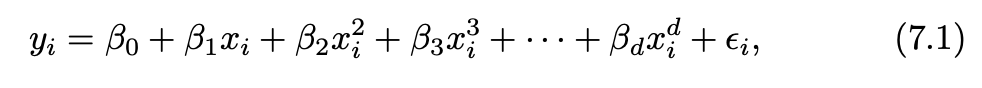
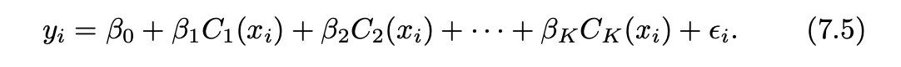
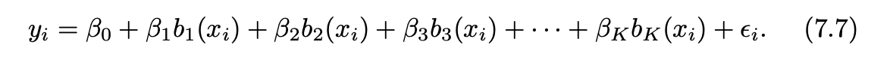
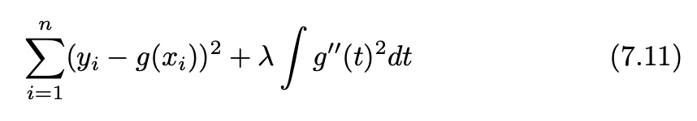

```{r include=F}
knitr::opts_chunk$set(echo=T, eval = T, message = F, warning = F)
```

## The extensions of linear models

- Polynomial regression

- Step function
- Splines

  - polynomial splines
  
  - natural splines
  
  - smoothing splines

- Local regression

- Generalized Additive Model (GAM)

---
## Polynomial regression

- raising each of the original predictors to a power



- Generally speaking, it is unusual to use greater than 3 or 4 because for large values of X the polynomial curve can become overly flexible and can take on some very strange shapes.

```{r eval = F}
lm(wage ~ poly(age, 4, raw = T), data = Wage)
```


---
## Step functions

- K points break X into bins (K + 1), then fit different **constant** (**indicator function**) in each bin. Indicator function equals 0 or 1, and only one 1 cross K+1 functions.



```{r eval = F}
lm(wage ∼ cut(age, 4), data = Wage)
```

--
### Basic function



---
## Regression splines

- Piecewise Polynomials: 
  - **knots** divide to different regions of X
  - **degree of polynomials** fit for each region.

--

- polynomial spline (`splines::bs`)
  - piecewise polynomial with contraints on knots
  - three constraints (continuity, continuity of the first derivative, and continuity of the second derivative)
  - **degrees of freedom** = number_of_knots + degree_of_polynomials + number_of_intercept
  - in practice it is common to place knots at uniform quantiles of the data. 

--

- natural spline (`splines::ns`)
  - polynomial spline with additional boundary constraints
  - **degrees of freedom** = number_of_knots + 1 + number_of_intercept
  - usually degree of polynomials = 3
  - `lm(wage ∼ ns(age, df = 4), data = Wage)`

using least squares to estimate the spline coefficients

???
https://stats.stackexchange.com/questions/517375/splines-relationship-of-knots-degree-and-degrees-of-freedom

---
## smoothing spline (`smooth.spline`)

- a function g that makes RSS small, but that is also smooth

  - "Loss+Penalty"
  
  - The first derivative g′(t) measures the slope of a function at t
  - the second derivative g''(t) is a measure of its roughness
  - the function g(x) that minimizes (7.11) is a shrunken natural cubic spline with knots at x1, . . . , xn. 

- **effective degrees of freedom** (df_lambda) decrease from n to 2 when lambda increase from 0 to inf

```{r eval =F}
fit <- smooth.spline(age, wage, df = 16)
```

---
## local regression (`stats::loess`)

- fit at a target point x0 using only the regression nearby training observations

- Hyperparameter **span s** is the proportion of points used to compute the local regression at x0
  - The smaller the value of s, the more local and wiggly will be our fit
  - `s = k/n` where k is k nearest neighbors.
  
- Using a **weighted** least squares regression

```{r eval=F}
fit <- loess(wage ∼ age, span = .2, data = Wage)
```

---
## Generalized additive models (GAMs) 

- provide a general framework for generalized extending a standard linear model by allowing non-linear functions of each additive of the variables,while maintaining additivity.

- a big linear regression model using an appropriate choice of basis functions

```{r eval = F}
gam1 <- lm(wage ~ ns(year, 4) + ns(age, 5) + education, data = Wage)

gam.s <- gam(wage ~ gam::s(age, df = 16) + education, data = Wage)

gam.lo <- gam(wage ~ gam::l(age, span = 0.7) + education, data = Wage)
```

---
## budget data

```{r}
library(tidymodels)
library(ISLR)

Wage <- as_tibble(Wage)

# initial split
set.seed(123)
wage_split <- initial_split(Wage)
wage_train <- training(wage_split)
wage_test <- testing(wage_split)

# cv folds
set.seed(234)
wage_folds <- vfold_cv(wage_train)
```


---
## polynomial regression tune

The order of polynomial is defined by `recipe::step_poly` at feature engineer step.

```{r}
# recipe
rec_poly <- recipe(wage ~ age, data = wage_train) %>%
  step_poly(age, degree = tune(), options = list(raw = TRUE))

# model
lm_spec <- linear_reg() %>%
  set_mode("regression") %>%
  set_engine("lm")

# workflow
poly_wf <- workflow() %>%
  add_model(lm_spec) %>%
  add_recipe(rec_poly)

# specify hyperparameter tune
degree_grid <- tibble(degree = 1:5)

# tune
poly_rs <- poly_wf %>% 
    tune_grid(
        resamples = wage_folds,
        grid = degree_grid
    )

```


---
## select best degree of polynomial

```{r echo=F}
poly_rs %>% 
    collect_metrics() %>% 
    ggplot(aes(x = degree, y = mean)) +
    facet_wrap(~.metric, scales = "free_y") +
    geom_point() +
    geom_line() +
    geom_errorbar(aes(ymin = mean - std_err, ymax = mean + std_err), width=0.2) +
    theme_bw()
```

---
## last fit using best degree of polynomial

```{r}
best_hyper <- select_by_one_std_err(poly_rs, metric = "rmse", degree)

best_hyper

poly_wf_final <- poly_wf %>% 
    finalize_workflow(best_hyper) %>% 
    last_fit(wage_split)

poly_wf_final %>% 
    extract_workflow() %>% 
    saveRDS("wage_poly_model.rds")
```

---
## final model metrics and parameters

- metrics on test data

```{r}
poly_wf_final %>% 
    collect_metrics()
```

- check co-efficient

```{r}
poly_wf_final %>% 
    extract_fit_parsnip() %>% 
    tidy()
```

---
## prediction using finalized polynomial

```{r echo = F}
poly_wf_final %>% 
    augment() %>% 
    ggplot(aes(x = age, y = wage)) +
    geom_point() +
    theme_bw() +
    geom_line(aes(y = .pred), color = "red") +
    geom_point(data = poly_wf_final %>% extract_workflow() %>% 
    augment(new_data =data.frame(age = 50)), aes(y = .pred), color = "red", size = 3)
```


```{r}
trained_poly_wf <- readRDS("wage_poly_model.rds")
trained_poly_wf %>% 
    augment(new_data =data.frame(age = 50))
```

---
## step function

`step_discretize()` will convert a numeric variable into a factor variable with n bins, n here is specified with `num_breaks`

If you already know where you want the step function to break then you can use `step_cut()` and supply the `breaks` manually.

```{r}
rec_discretize <- recipe(wage ~ age, data = Wage) %>%
  step_discretize(age, num_breaks = 4)

discretize_wf <- workflow() %>%
  add_model(lm_spec) %>%
  add_recipe(rec_discretize)

discretize_rs <- fit_resamples(
    discretize_wf, 
    resamples = wage_folds
    )

discretize_rs %>% 
    collect_metrics()
```

??? 
`fit_resamples` their only purpose is for computing the .metrics to estimate performance.

---
## step function final fit

```{r}
discretize_wf_final <- discretize_wf %>% 
    last_fit(wage_split)

discretize_wf_final %>% 
    extract_fit_parsnip() %>% 
    tidy()
```

---
## step function prediction

```{r echo=F}
discretize_wf_final %>% 
    augment() %>% 
    ggplot(aes(x = age, y = wage)) +
    geom_point() +
    geom_line(aes(y = .pred), color = "red") +
    theme_bw()
```


---
## polynomial splines / cubic splines

In the example, author directly specifies the internal breakpoints that define the spline, which usually takes quantiles for multiple knots.

Here, we tune number of `knots` by degree of freedom `deg_free`.

For more details, `?step_bs` or `?bs`.

```{r}
rec_cubic <- recipe(wage ~ age, data = Wage) %>%
  step_bs(age, deg_free = tune(), degree = 3)

cubic_wf <- workflow() %>%
  add_model(lm_spec) %>%
  add_recipe(rec_cubic)

grid_df <- grid_regular(
    deg_free(range = c(4,12)), 
    levels = 5
)

cubic_rs <- tune_grid(
    cubic_wf, 
    resamples = wage_folds,
    grid = grid_df 
    )
```


---
## select best hyparameter (`deg_free`)

```{r}
best_hyper <- select_by_one_std_err(cubic_rs, metric = "rmse", deg_free)

best_hyper

cubic_wf_final <- cubic_wf %>% 
    finalize_workflow(best_hyper) %>% 
    last_fit(wage_split)
```


---
## final model metrics and parameters

- metrics on test data

```{r}
cubic_wf_final %>% 
    collect_metrics()
```

- check co-efficient

```{r}
cubic_wf_final %>% 
    extract_fit_parsnip() %>% 
    tidy()
```

---
## Compare predictions among multiple models.


.pull-left[
```{r echo = F}
cubic_wf_final %>% 
    augment() %>% 
    mutate(model = "cubic spline (df = 4)") %>% 
    bind_rows(
         poly_wf_final %>% 
             augment() %>% 
             mutate(model = "polynomial (degree = 2)")
    ) %>% 
        bind_rows(
            discretize_wf_final %>% 
                augment() %>% 
                mutate(model = "step function (knots = 3)")
        ) %>% 
    ggplot(aes(x = age, y = wage)) +
    geom_point() +
    theme_bw() +
    geom_line(aes(y = .pred, color = model))
    
```
]


.pull-right[
```{r echo = F}
bind_rows(
    bind_rows(
        discretize_wf_final %>%
            collect_metrics() %>%
            mutate(model = "step function (knots = 3)"),
        cubic_wf_final %>%
            collect_metrics() %>%
            mutate(model = "cubic spline (df = 4)"),
        poly_wf_final %>%
            collect_metrics() %>%
            mutate(model = "polynomial (degree = 2)")
    ) %>%
        filter(.metric == "rmse") %>%
        mutate(data = "test data"),
    bind_rows(
        discretize_rs %>%
            collect_metrics() %>%
            filter(.metric == "rmse") %>%
            mutate(model = "step function (knots = 3)") ,
        cubic_rs %>%
            select_by_one_std_err(metric = "rmse", deg_free) %>%
            mutate(model = "cubic spline (df = 4)"),
        poly_rs %>%
            select_by_one_std_err(metric = "rmse", degree) %>%
            mutate(model = "polynomial (degree = 2)")
        
    ) %>%
        select(.estimate = mean, .metric, model) %>%
        mutate(data = "train data")
) %>% 
    select(.metric, .estimate, data, model) %>% 
    ggplot(aes(x = data, y = .estimate, fill = model)) +
    geom_col(position = position_dodge()) +
    theme_bw() +
    labs(y = "RMSE")

```
]

